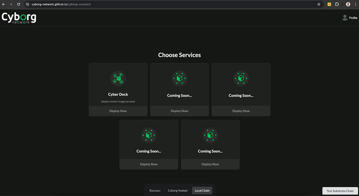
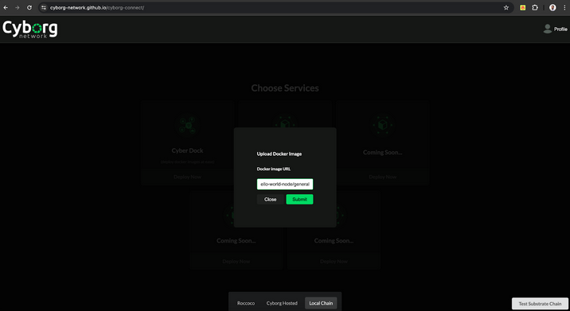

# Introduction

Test instructions

## Chain Workflow

The edge-connect pallet provides functionalities to manage connected workers within the system. It provides functionality that registers `register_worker` and removes `remove_worker` workers associated with user accounts. 
There is a storage map that tracks worker details including status, IP, domain, availability status, specs and creation block.

This information is then used by the task-management pallet to issue tasks to connected workers. 

A task can be submitted by any account to a `task_scheduler` extrinsic. The task assigned an account with a registered worker called the `executor`. Once a task is completed, the `executor` submits an extrinsic call `submit_completed_task` with the `TaskId` it was assigned and a hash output of the task. This information is used to then verify the task by another different assigned account with a registered worker called `verifier` which will perform the given task and sumbit its own hash output of the task along with the `TaskId` to an extrinsic call `verify_completed_task`. If the hashes are the same, the task is complete. If they differ, another different account with a registered worker is assigned as the `resolver` role. This account will perform the task and also sumbit a hash output of the task with the same `TaskId` to an extrinsic called `resolve_completed_task`. The matching hash with either of the `executor` or `verifier` is the correct task output. Should the resolver also fail, the task is reassigned to a new executor different from all three participating accounts in this task verification.

## Setup 

Compile the node:

```bash
cargo build --release
```

### Local Development Chain

🧟 This project uses [Zombienet](https://github.com/paritytech/zombienet) to orchestrate the relaychain and parachain nodes.
You can grab a [released binary](https://github.com/paritytech/zombienet/releases/latest) or use an [npm version](https://www.npmjs.com/package/@zombienet/cli).

This template produces a parachain node.
You still need a relaychain node - you can download the `polkadot`
(and the accompanying `polkadot-prepare-worker` and `polkadot-execute-worker`)
binaries from [Polkadot SDK releases](https://github.com/paritytech/polkadot-sdk/releases/latest).

Make sure to bring the parachain node - as well as `polkadot`, `polkadot-prepare-worker`, `polkadot-execute-worker`,
and `zombienet` - into `PATH` like so:

```sh
export PATH="./target/release/:$PATH"
```

This way, we can conveniently use them un the following steps.

👥 The following command starts a local development chain, with a single relay chain node and a single parachain collator:

```sh
zombienet --provider native spawn ./zombienet.toml

# Alternatively, the npm version:
npx --yes @zombienet/cli --provider native spawn ./zombienet.toml
```

## Demo

### K3s Setup

Follow the instructions in the [k3s worker repository](https://github.com/Cyborg-Network/Worker/blob/main/README.md) to setup a k3s cluster for testing the full flow of this appchain.

Upon Successful setup proceed to start registering clusters onchain

### Onchain Interaction

#### Register a Worker

Go to the [`Polkadotjs Apps`](https://polkadot.js.org/apps/?rpc=ws://127.0.0.1:9988#/) with the correct websocket port set for the parachain (should be port 9988). This should also appear in the terminal for zombienet for `alice-1` in the Direct Link section:


<br></br>

Once your parachain node starts producing blocks, navigate to the extrinsics tab and select the `edge-connect`.


Tick the option to include domain and enter in your domain, or you can tick the option to include an IP/Port.


Then sign and submit the transaction. Congrats, you've registered your worker on chain!

#### Task Creation

Anyone can register a task onchain. The task at this point will have to be a valid docker image that is publically accessable. For a task to be created, at least one worker must be registered.

To create a task, navigate to the `taskManagement` extrinsic to select the `taskScheduler` function. Enter in a valid docker image in the `taskData` section then sign and submit.


Go to the explorer section to view which worker called `executor` was assigned the task. This account must complete the task and submit a hash out the task output.


Congrats! A task was successfully scheduled!

#### Task Completion and Verification

In order for the task to be successfully verified as complete, two more workers need to be registered. One worker to verify task output correctness and the second in case the first fails the verification. Follow the steps above to register two more workers.

Now, from the same account that was assigned the task, navigate to `taskManagement` extrinsic to the method `submitCompletedTask`. Use the `taskId` and enter in a hash value.


Once submitted, navigate to the explorer section to view which worker was assigned as `verifier`.


Now, from the `verifier` account, navigate to `taskManagement` extrinsic to the method `submitCompletedTask`. Use the `taskId` and enter in a hash value.

You can enter in the same hash value as earlier or a different one. The same hash value will complete the task whereas having a different hash value will assign a `resolver`. 

With the same hash:


Check the explorer to see an event emitted for the taskId that is verified as complete:


Check chain state in `taskManagment` for `taskStatus` call of the `taskId` that it shows `Completed`.


Should the hash from both workers `verifier` and `executor` differ, then a worker will be assigned as `resolver`. You can check for this in the explorer section of the events for `VerifierResolverAssigned` event to find the `resolver`. Following the similar steps as above, you will enter into the `taskManagement` extrinsic and select the `resolveCompletedTask` method to enter in the `taskId` and a output hash.


### Testing with k3s Worker and Frontend

#### Setup Workers

##### Step 1
In a seperate terminal or IDE window clone the Worker repository:
```
git clone https://github.com/Cyborg-Network/Worker.git
```
Make sure to checkout the branch for the parachain
```
git fetch && git branch -a
```
```
git checkout -b updated-parachain remotes/origin/updated-parachain
```
Then follow the rest of the instructions from the Worker repository.
Ensure that you have a master node setup with at least one worker node in your k3s worker instance from the [`Worker Repository`](https://github.com/Cyborg-Network/Worker/tree/updated-parachain)

Keep track of the IP/Port or Domain used to access the API endpoints. This will be used to register your k3s worker on chain.

Note: Make sure to have at least one worker node per master node.

##### Step 2
Repeat the above 2 more times to setup 3 workers in total

##### Step 3

Follow the steps in `Onchain Interaction` about the `Register a Worker` section above to register all 3 workers.

#### Setup Frontend

##### Step 1
In a seperate terminal or IDE window clone the frontend repository [`Cyborg-Connect`](https://github.com/Cyborg-Network/cyborg-connect/tree/parachain-updates):
```
https://github.com/Cyborg-Network/cyborg-connect.git
```
Make sure to checkout the branch for the parachain
```
git fetch && git branch -a
```
```
git checkout -b parachain-updates remotes/origin/parachain-updates
```
##### Step 2

1) Compile and run Cyborg Connect 
2) Open http://127.0.0.1:8000/cyborg-connect/ in a web browser
3) Switch to Cyborg hosted in the bottom bar
4) In the docker image url section enter any one of the following file names
https://github.com/docker-library/official-images/tree/master/library
Eg. hello-world (prints hello world message)

#### Test Workflow

1) Connect wallet and choose the ‘Access Compute’ option
    
2) Choose CyberDock from the list of product lines
    
3) Enter the docker image name (e.g. hello-world)
    
4) Pay the fees
    
5) Loader Screen
    
6) Node List Screen
    
7) Deployment dashboard 
    
