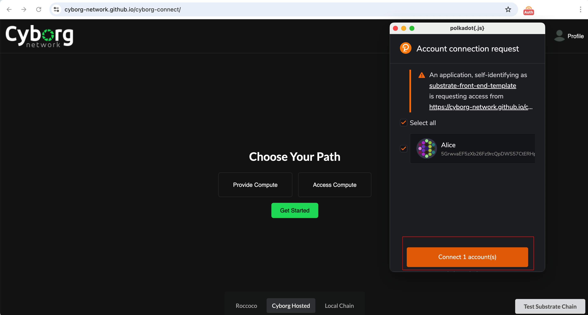
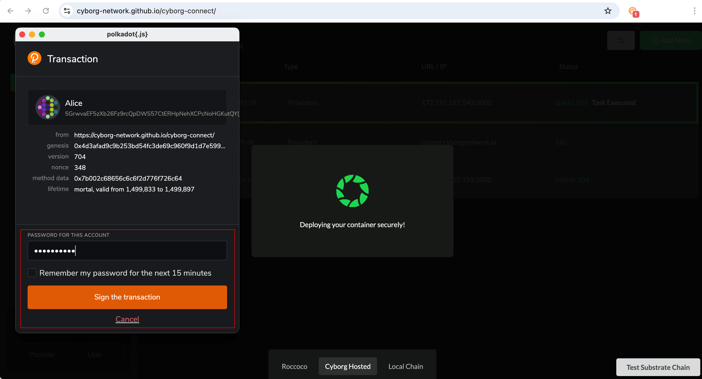
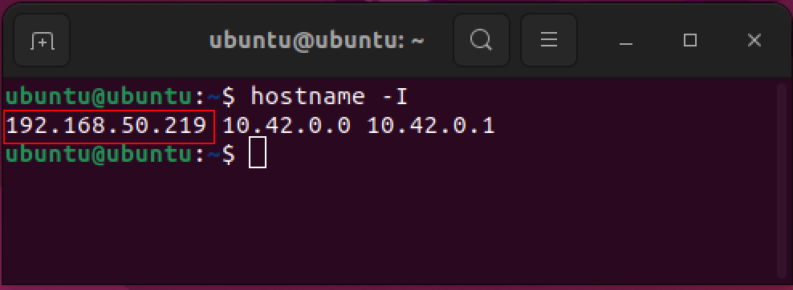

# Cyborg Network - Milestone 1 Delivery

## Introduction

The baseline infrastructure layer of the Cyborg Network parachain is delivered as part of this grant. This includes a sample product line called CyberDock, which allows users to deploy publicized Docker images into our network of edge servers. The executed container results will be verified by parallel execution and Hash equations.

**Key Components**
We have developed and submitted two primary pallets:

- **Edge Connect** - Manages the connection and management of off-chain workers (K3s clusters).
- **Task Management** - Oversees task scheduling to remote K3s clusters based on availability and specifications.

**Prototype Overview**
This prototype is a blockchain-based machine learning training module featuring on-chain verification and settlement. It is designed to simulate real-world scenarios involving multiple virtual machine, accurately representing the interaction between blockchain and off-chian components (K3s clusters). These components coordinate to execute tasks, submit result, and update task execution statuses.

**Testing Environment**
To simplify the testing process, we provide a pre-hosted version of the Cyborg parachain on the `Tanssi Dancebox` testnet. This environment includes an active K3s cluster, allowing you to directly test the application's workflow. We will discuss both local and hosted testing methods to ensure a clear understanding of the delivery process.

## Code Repositories

- [Cyborg Parachain](https://github.com/Cyborg-Network/cyborg-parachain) - The Cyborg Substrate Parachain.
- [Cyborg Connect](https://github.com/Cyborg-Network/cyborg-connect) - The Frontend for our App.
- [Worker](https://github.com/Cyborg-Network/Worker) - The K3S worker configuration for Docker image execution.

## Chain Workflow

<br>

**Edge Connect Pallet**
The edge-connect pallet is responsible for managing the connected workers within the system It provides functionality to register (`register_worker`)  and remove (`remove_worker`) workers lined to user accounts. A storage map maintains worker details, including status, IP, Domain, availability, specifications, and creation block.

**Task Management Pallet**
The task-management pallet leverages the worker information to assign tasks to connected workers. The workflow includes:
- **Task Submission**: Any account can submit a task using `task_scheduler` extrinsic.

- **Task Execution**: The task is assigned to an account with registered worker, know as the `executor`.

- **Task Completion**: Upon completion, the executor submits the `submit_completed_task` extrinsic, including the `TaskId` and the tasks's hash output.

- **Task Verification**: A `verifier`, another account with a registered worker, re-executes the task and submits their hash output with the `TaskId` using the `verify_completed_task` extrinsic. If the hashes match, the task is marked as `completed`. if not, a `resolver` is assigned.

- **Task Resolution**: The resolver performs the task and submits a hash output with the same `TaskId` using `resolve_completed_task` extrinsic. The correct task output is determined based on matching hashes. if none match, the task is reassigned to a new executor, disticnt from the previous accounts involved.

**Task Example:**

- `hello-world`: - Prints the Docker hello world message.
- `cyborgnetwork/simple-python:new`: - A sample Python program with arithmetic functions.
- `cyborgnetwork/flog_loader:latest`: - A loader app to test logs.
  
## Testing Guide

### 1 Prerequisites - Wallets and Accounts

Only accounts with a minimum balance can execute transactions. The `Alice` account is prefunded with the chain's tokens and will be used to interact with the frontend.
Whether you are testing locally or using the hosted version of our chain, you will need to use the `Alice` account.

To use the `Alice` account, swtich to it or import it through the seed phrase using your prefered wallet extension:

Using a wallet extension of your choice, switch to the `Alice` test account or import `Alice` through the seed phrase:

```bash
bottom drive obey lake curtain smoke basket hold race lonely fit walk//Alice
```

 Steps to Add the Alice Account in `Polkadot.js` Wallet Extension:

- Click the plus icon to reveal a drop-down menu.
- Select `Import account from pre-existing seed`.

<br><br>

- Paste the Alice seed phrase and click `Next`.

<br><br>

- Add a name and password, then add the account.

<br><br>

- Once successful, you should see the Alice account listed.

<br><br>

### 2. Testing the hosted version (Cloud Server)

#### 2.1 Running the Application

You can either:

- Option 1: Compile and run [Cyborg Connect](https://github.com/Cyborg-Network/cyborg-connect).
- Open URL <http://127.0.0.1:8000/cyborg-connect/> in a web browser.

#### 2.1 Testing the Workflow

1 Connect your wallet when prompted, ensuring you select the Alice wallet or a another funded account and click `Access Compute`.

<br><br>
2 Select the hosted chain.

<br><br>
3 Choose CyberDock from the list of product lines.

<br><br>
4 Enter the Docker image name (e.g., hello-world).

- In the Docker image url section enter any one of the file names in the [task examples](https://github.com/Cyborg-Network/cyborg-parachain/blob/master/INSTRUCTIONS.md#task-examples).
- Any `app/script/website` published as a public Docker image for `linux/amd64` will execute in this system.
E.g., hello-world (prints hello world message)


5 Pay the fees.

<br><br>
6 Wait for the task to execute (Loader Screen).

<br><br>
7 View the Node List screen. The tasks should be assigned randomly to an available worker.
If you registered another worker, the task might be executed by another worker instead.

- Click through the workers by selecting the left `Dashboard` tab to see the executed task.

<br><br>
8 Access the Deployment dashboard


### 3. Testing on a Local Machine (Installed VM)

#### 3.1 Prerequsites - Infrastructure Setup

##### 3.1.1 Operating System: Ubuntu Debian 20.04 or Higher

You will need a local Linux machine and two servers hosted within the same virtual network (such as a VPC in the case of AWS):

- **Local Machine**: Host the Parachain and Frontend.
- **Server 1**: K3s master node.
- **Server 2**: K3s worker node.

##### 3.1.2 Server Setup Example for Cloud Azure

When deploying servers from a cloud provider, you have the option to add new servers to an existing network.
It is crucial that both the K3S master node and worker node are connected within the same network to ensure seamless load distribution, especially when managing heavier data loads such as machine learning models.

1 Under the `Create a VM` section, choose `Ubuntu 20.04 or 22.04 LTS`.

<br><br>

2 In the customization dashboard, create a new resource group and deploy the master node server.
Then create a new deployment for worker node.

<br><br>

3 Now, choose the same resource group that was created for the first server.

<br><br>

4 In the `Networking` tab, check that the VNet is the same as that of the master node, then deploy the second server.

<br><br>

5 Cross-verify the VNet of both deployed servers.

<br><br>
<br><br>

6 Finally, go to the `Networking` tab of your virtual machine and add a new `inbound` rule for `port` `3000`.
Then Hit `Create port rule`.

<br><br>

7 Change only the `Destination port ranges` to `3000` and click `Add` once complete.
The name should default to `AllowAnyCustom3000Inbound`.
You should now see the new rule within your `Network Settings` dashboard.

<br><br>

8 Get `Master Node` IP Address


##### 3.1.3 Server Setup Example for Local VM using UTM

1 Download and Install UTM (Visit the UTM website: https://mac.getutm.app)

- Visit the [UTM website](https://mac.getutm.app) to download and install the application.

2 Open UTM Application, Download pre-build Ubuntu Image from UTM Galery

- The Ubuntu username and password are provided in the description.


3 Duplicte the Ubuntu Server VM

- Once the Ubuntu Server VM is downloaded, you'll need two instances.

- To do this, right-click the downloaded Ubuntu Server VM and select Duplicate (e.g., Ubuntu_22.04_Master.utm and Ubuntu_22.04_Worker.utm)

- This will create an identical copy of the Ubuntu Server VM, giving you two separate VMs.

- Create directory that you want to share between your Mac and the Ubuntu Server VMs (e.g., SharedDirectory).

- Set Network Mode to Bridge, configure the Inteface and Random Mac Address


4 Start Both Ubuntu Server VMs.

- Open the Ubuntu_Master and Ubuntu_Worker VM and set the Share Directory to `SharedDirectory`.


5 Install Networking Utilities

```bash
# update the list of package source for new VM
sudo apt-get update

# Install Ping utility
sudo apt-get install iputils-ping

# Install SSH Server
sudo apt-get install openssh-server

# Install Telnet
sudo apt-get install telnet

# Telnet installation need reboot
sudo reboot

# Install the Uncomplicated Firewall (UFW)
sudo apt-get install ufw

# Install the Netcat for port testing
sudo apt-get install netcat

```

6 Open Port on **Ubuntu_Master VM**.

```bash
# Check the current status of the firewall
sudo ufw status

# Enable the firewall to start on boot and activate it immediately
sudo ufw enable

# Allow traffic on port 22 - SSH
sudo ufw allow ssh

# Allow traffic on port 3000
sudo ufw allow 3000/tcp

# Reload the firewall to apply changes
sudo ufw reload
```


7 Connectivity Testing

```bash
# Test SSH connectivity
sudo telnet <ip addr> 22

# Test Telnet to port 3000 on Master VM
#Run this command on the Master VM terminal to listen on port 3000
Sudo nc -l 

#Run this command on the Workder VM terminal to connect to the Master VM
sudo tenet <master-vm-IP-address> 3000

```

#### 3.2 Application Setup

##### 3.2.1 Overview of K3s Workers

K3s Workers serve as service providers within the network. These workers connect to the RPC endpoint of the blockchain to receive updates and information regarding task execution.
Each K3s worker setup includes one `master node` and at least one `worker node`. The `master node` supplies its `IP` address or `domain name` to the blockchain, enabling the chain to distribute tasks to it.

Once the `master node` receives instructions from the blockchain, it assigns the tasks to its `worker nodes` for execution. Due to the networking requirements, the `master node` and `worker nodes` should be set up on separate machines, ideally within the same local network.

When setting up servers for the K3s workers, ensure that you use two distinct Ubuntu VMs deployed within the same virtual network to facilitate seamless connectivity via their local IP addresses. For AWS, use a VPC; for Azure, deploy both servers within the same virtual network.

Below is an example setup of a K3s Worker that connects to the local blockchain.

##### 3.2.2 Master Node Setup

The following activities will be performed on the Ubuntu Master VM.

**1  Clone Repository and Install Node.js Dependencies**

Clone the worker repository

- If `git` is not installed on your system, you can install it by running `sudo apt-get install git` in terminal on Ubuntu.

```bash
# Install git if doesn't exist
sudo apt-get install git

# Clone the repository
git clone https://github.com/Cyborg-Network/Worker.git

# Navigate to your project directory
cd Worker

# Update the local repository and list the available branches
git fetch && git branch -a

# Check out the `updated-parachain` branch from the repository.
git checkout -b updated-parachain origin/updated-parachain

# List Branch
git branch -v

```


Install the required Node.js dependencies

- Install Node.js version 18 or above, you can check your current Node.js version by running `node -v` in terminal on Ubuntu.

```bash
# Install nvm (Node Version Manager.
curl -o- https://raw.githubusercontent.com/nvm-sh/nvm/v0.40.0/install.sh | bash

# Reload bash shell
source ~/.bashrc

# download and install Node.js (you may need to restart the terminal).
nvm install 18

# verifies the right Node.js version is in the environment.
# it should print v18.20.4
node -v   


# verifies the right npm version is in the environment
# it should print 10.7.0
npm -v
```


**2 Configure the Environment**
Copy the `.env.example` file and replace the contents:

- Set `WORKER_ADDRESS` to the address where you register this worker on the Cyborg Network chain.
- Set `RPC_ENDPOINT` to the correct RPC endpoint of the chain you are testing on.
**Note:** The `.env.example` file is hidden. you can view it in terminal using `ls -a`.

```bash
cp .env.example .env

```


**3 Run the Master Setup Script**
Execute the `MasterSetup.sh` script:

- If  you encounter dependency error, you can install the required dependecies by running `npm install` in terminal on Ubuntu.

```bash
# Make the MasterSetup.sh script executable
chmod +x MasterSetup.sh

# Run the MasterSetup.sh script with elevated privileges
sudo sh MasterSetup.sh

```

This script performs the following actions:

- Installs K3s on the master node.
- Saves the K3s node join token to `k3s-node-token.txt`.
- Starts the Node.js application that listens for deployment requests on port 3000.


**4 Verify K3s Service Status**

```bash
sudo systemctl status k3s
```


**5 Get Master Node IP Address**

```bash
# List the IP Address
hostname -I
```



##### 3.2.3 Worker Node Setup

The following activities will be performed on the Ubuntu Worker VM.

**1 Execute Worker Setup Script**

On each worker node, run the `WorkerSetup.sh` script with the worker's name (use any name of your choice), master node's private IP address, and the join token from the `k3s-node-token.txt` file:

**1  Clone Repository and Install Node.js Dependencies**

Clone the worker repository

- If `git` is not installed on your system, you can install it by running `sudo apt-get install git` in terminal on Ubuntu.

```bash
# Install git if doesn't exist
sudo apt-get install git

# Clone the repository
git clone https://github.com/Cyborg-Network/Worker.git

# Navigate to your project directory
cd Worker

# Update the local repository and list the available branches
git fetch && git branch -a

# Check out the `updated-parachain` branch from the repository.
git checkout -b updated-parachain origin/updated-parachain

# List Branch
git branch -v

```

**2 Run the Worker Setup Script**
Execute the `WorkerSetup.sh` script:

- The private IP address for the Master Node in Azure in this example is `10.0.0.5`.
- The private IP address for the Master Node in Local VM in this example is `192.168.64.2`
- Retrieve the token from `k3s-node-token.txt` on the Master Node.

```bash
sh WorkerSetup.sh <worker-name> <master-ip> <token>
```

Replace `<worker-name>`, `<master-ip>`, and `<token>` with your specific details.

- Example for Azure:

```bash
# Make the WorkerSetup.sh script executable
chmod +x WorkerSetup.sh

# Replace these values with your own IP and token
sh WorkerSetup.sh worker-one 10.0.0.5 K10c8230eebd6c64c5cd5aa1::server:8ce7cae600cd 
```

- Example for Local VM:

```bash
# Make the WorkerSetup.sh script executable
chmod +x WorkerSetup.sh

# Replace these values with your own IP and token
sh WorkerSetup.sh worker-one 192.168.64.2 K10c8230eebd6c64c5cd5aa1::server:8ce7cae600cd 
```


##### 3.2.4 Verify Worker Connection

Go back to your master node and execute the followign command to verify the connection between your master and worker nodes:

```bash
kubectl get nodes
```

You should see that there is one master node and one worker node listed. This indicates that the worker node has successfully joned the K3s cluster.

<br></br>

if the setup was successful, you can proceed to register the K3s clusters on the blockchain.

**Registering Cluster On-Chain**
1 **Ensure Inbound Request on Port 3000:**

- The master node's port 3000 must be configure to accept inbound requests. This is necessary for registering the K3s workers on the blockchain, as the IP address and port will be used during the registration process.

For more info regarding the worker nodes, you can visit the [`Worker Repository`](https://github.com/Cyborg-Network/Worker/tree/updated-parachain)

### Cyborg Parachain

Clone the parachain repository with:

```bash
git clone --recurse-submodules https://github.com/Cyborg-Network/cyborg-parachain.git
```

Alternatively, you can run:

```bash
git clone https://github.com/Cyborg-Network/cyborg-parachain.git
git submodule update --init
```

Compile the node:

```bash
cargo build --release
```

🐳 Alternatively, build the Docker image:

```sh
docker build . -t cyborg-parachain
```

## Run Tests

```bash
cargo test
```

## Local Development Chain

🧟 This project uses [Zombienet](https://github.com/paritytech/zombienet) to orchestrate the relaychain and parachain nodes.
You can grab a [released binary](https://github.com/paritytech/zombienet/releases/latest) or use an [npm version](https://www.npmjs.com/package/@zombienet/cli).

This template produces a parachain node. You still need a relaychain node. You can download the `polkadot` binaries (and the accompanying `polkadot-prepare-worker` and `polkadot-execute-worker`) from [Polkadot SDK releases](https://github.com/paritytech/polkadot-sdk/releases/latest).

Make sure to bring the parachain node, as well as `polkadot`, `polkadot-prepare-worker`, `polkadot-execute-worker`,
and `zombienet` - into `PATH` like so:

```sh
export PATH="./target/release/:$PATH"
```

This way, we can conveniently use them un the following steps.

👥 The following command starts a local development chain, with a single relay chain node and a single parachain collator:

```sh
zombienet --provider native spawn ./zombienet.toml

# Alternatively, the npm version:
npx --yes @zombienet/cli --provider native spawn ./zombienet.toml
```

### Register on k3s

Make sure you have the domain or IP address of your worker node. You will use this to register the worker on-chain so that the blockchain can assign tasks to the IP or domain.

- Head over to our [[Hosted Chain]](https://polkadot.js.org/apps/?rpc=wss://fraa-flashbox-3239-rpc.a.stagenet.tanssi.network#/extrinsics)
- Navigate to the extrinsics tab and select the `edge-connect`.
- Go to domain and tick the option to include it
- Enter your domain along with port 3000 which is used by the K3s Worker node, in the format `yourIpAddress:3000`.
Replace `yourIpAddress` with your you master node's public IP address. 
If you registered a domain for your master node, you can use a domain name (e.g. yourWorker-cloud.com).

<br><br>

- Submit and sign the transaction with a funded account

<br><br>

Wait for the transaction to succeed and view it at the block explorer. Congratulations, you've registered your worker on chain!

## Onchain Interaction

### Register a Worker

Go to the [`Polkadotjs Apps`](https://polkadot.js.org/apps/?rpc=ws://127.0.0.1:9988#/) with the correct websocket port set for the parachain (which should be port 9988). This should also appear in the terminal for zombienet for `alice-1` in the Direct Link section:

<br></br>

Once your parachain node starts producing blocks, navigate to the extrinsics tab and select `edge-connect`.

<br><br>

Tick the option to include domain and enter your domain, or tick the option to include an IP/Port.

<br><br>

Then sign and submit the transaction. Congratulations, you've registered your worker on-chain!

### Task Creation

Anyone can register a task onchain. The task must be a valid Docker image that is publically accessable. To create a task, at least one worker must be registered.

To create a task, navigate to the `taskManagement` extrinsic to select the `taskScheduler` function. Enter a valid Docker image in the `taskData` section then sign and submit.

<br><br>

Go to the explorer section to view which worker called `executor` was assigned the task. This account must complete the task and submit a hash out the task output.

<br><br>

Congratulations! A task was successfully scheduled!

### Task Completion and Verification

For the task to be successfully verified as complete, two more workers need to be registered. One to verify task output and a second in case the first fails the verification. 
Follow the steps above to register two more workers.

Now, from the account assigned the task, navigate to `taskManagement` extrinsic to the `submitCompletedTask` method. Use the `taskId` and enter a hash value.

<br><br>

Once submitted, navigate to the explorer section to view which worker was assigned as `verifier`.

<br><br>

Now, from the `verifier` account, navigate to the `taskManagement` extrinsic and select the `submitCompletedTask` method. Use the `taskId` and enter a hash value.

You can enter in the same hash value as before or a different one. The same hash value will complete the task, while a different hash value will assign a `resolver`.

With the same hash:

<br><br>

Check the explorer to see an event emitted for the taskId that is verified as complete:

<br><br>

Check chain state in `taskManagment` for `taskStatus` call of the `taskId` to ensure it shows `Completed`.
<br><br>

If the hashes from both `verifier` and `executor` differ,  a worker will be assigned as `resolver`. You can check for this in the explorer section of the events for `VerifierResolverAssigned` event to find the `resolver`.
Following the similar steps as above, you will enter the `taskManagement` extrinsic and select the `resolveCompletedTask` method to enter the `taskId` and a output hash.

# Worker Logs

The results of executed tasks are displayed in the terminal section of the deployment dashboard. Below are examples of worker logs corresponding to the task examples mentioned above.

## Hello World

    [172.212.108.104:3000][TaskID: 74] Status: 2024-08-06T13:54:01.000Z
    [172.212.108.104:3000][TaskID: 74] Status: ReplicaSet "dynamic-deployment-569b8o-54cc46b66d" has successfully progressed.
    [172.212.108.104:3000][TaskID: 74] Status: NewReplicaSetAvailable
    [172.212.108.104:3000][TaskID: 74] Status: True
    [172.212.108.104:3000][TaskID: 74] Status: Progressing
    [172.212.108.104:3000][TaskID: 74] Logs: Hello from Docker! This message shows that your installation appears to be working correctly. To generate this message, Docker took the following steps: 1. The Docker client contacted the Docker daemon. 2. The Docker daemon pulled the "hello-world" image from the Docker Hub. (amd64) 3. The Docker daemon created a new container from that image which runs the executable that produces the output you are currently reading. 4. The Docker daemon streamed that output to the Docker client, which sent it to your terminal. To try something more ambitious, you can run an Ubuntu container with: $ docker run -it ubuntu bash Share images, automate workflows, and more with a free Docker ID: https://hub.docker.com/ For more examples and ideas, visit: https://docs.docker.com/get-started/

## Simple python

    [172.212.108.104:3000][TaskID: 75] Status: 2024-08-06T13:58:07.000Z
    [172.212.108.104:3000][TaskID: 75] Status: ReplicaSet "dynamic-deployment-mkiqwb-764c6c87" has successfully progressed.
    [172.212.108.104:3000][TaskID: 75] Status: NewReplicaSetAvailable
    [172.212.108.104:3000][TaskID: 75] Status: True
    [172.212.108.104:3000][TaskID: 75] Status: Progressing
    [172.212.108.104:3000][TaskID: 75] Logs: Let's look at some basic math operations one by one 10 + 5 = 15 10 - 5 = 5 10 x 5 = 50 10/5 = 2.0 10^5 = 100 Factorial of 5: 120 Logarithm (base e): 1.0 Sine (of 30 degrees): 0.49999999999999994 Cosine (of 45 degrees): 0.7071067811865476 Tangent (of 60 degrees): 1.7320508075688767 Test Complete!!

## Flog Loader

    [172.212.108.104:3000][TaskID: 76] Status: 2024-08-06T13:59:25.000Z
    [172.212.108.104:3000][TaskID: 76] Status: ReplicaSet "dynamic-deployment-326ael-59f7557547" has successfully progressed.
    [172.212.108.104:3000][TaskID: 76] Status: NewReplicaSetAvailable
    [172.212.108.104:3000][TaskID: 76] Status: True
    [172.212.108.104:3000][TaskID: 76] Status: Progressing
    [172.212.108.104:3000][TaskID: 76] Logs: 133.122.255.57 - wintheiser6332 [06/Aug/2024:13:59:27 +0000] "PUT /next-generation/scale HTTP/1.0" 200 2094 169.217.248.61 - krajcik8327 [06/Aug/2024:13:59:27 +0000] "HEAD /e-enable/repurpose/best-of-breed/web+services HTTP/1.1" 302 1496 219.150.119.243 - - [06/Aug/2024:13:59:27 +0000] "HEAD /paradigms/users/networks/visionary HTTP/1.1" 203 1720 205.181.52.92 - mohr3286 [06/Aug/2024:13:59:27 +0000] "DELETE /revolutionize/repurpose/interfaces HTTP/2.0" 502 25014 221.191.100.146 - - [06/Aug/2024:13:59:27 +0000] "PUT /unleash/transition/innovate/cutting-edge HTTP/1.0" 504 18160 198.99.83.98 - - [06/Aug/2024:13:59:27 +0000] "DELETE /models/sticky/drive/repurpose HTTP/1.0" 503 15005 128.128.104.12 - - [06/Aug/2024:13:59:27 +0000] "PATCH /interactive/synergize/holistic/seize HTTP/1.0" 400 26731 217.66.202.111 - herman1613 [06/Aug/2024:13:59:27 +0000] "POST /ubiquitous/innovate/utilize HTTP/1.0" 302 1253 66.55.244.23 - - [06/Aug/2024:13:59:27 +0000] "GET /evolve HTTP/1.1" 203 982 33.43.231.205 - kuvalis2662 [06/Aug/2024:13:59:27 +0000] "HEAD /engage HTTP/1.1" 204 13898 229.76.176.117 - - [06/Aug/2024:13:59:27 +0000] "DELETE /monetize/orchestrate HTTP/2.0" 302 15400 205.99.160.214 - - [06/Aug/2024:13:59:27 +0000] "POST /synthesize/unleash HTTP/1.1" 301 4818 142.231.87.13 - hettinger8564 [06/Aug/2024:13:59:27 +0000] "DELETE /expedite/e-enable/redefine HTTP/1.1" 204 26815 178.57.223.231 - - [06/Aug/2024:13:59:27 +0000] "POST /content/value-added/bleeding-edge HTTP/1.0" 200 5631 206.138.70.85 - renner6635 [06/Aug/2024:13:59:27 +0000] "PATCH /evolve/iterate/exploit HTTP/1.0" 400 22447 173.97.14.35 - - [06/Aug/2024:13:59:27 +0000] "DELETE /deploy/reinvent HTTP/1.0" 403 255 20.153.146.178 - - [06/Aug/2024:13:59:27 +0000] "DELETE /productize HTTP/1.1" 401 20413 182.140.64.142 - - [06/Aug/2024:13:59:27 +0000] "GET /frictionless/technologies HTTP/1.1" 404 26944 233.158.237.53 - - [06/Aug/2024:13:59:27 +0000] "PATCH /world-class/portals HTTP/1.1" 500 26419 223.117.253.103 - - [06/Aug/2024:13:59:27 +0000] "POST /facilitate HTTP/1.0" 501 3545 6.200.160.191 - schaden2671 [06/Aug/2024:13:59:27 +0000] "GET /vertical/best-of-breed/incentivize HTTP/2.0" 200 9874 113.6.51.228 - - [06/Aug/2024:13:59:27 +0000] "DELETE /syndicate/bleeding-edge/front-end/scale HTTP/1.1" 205 16420 213.247.72.172 - witting8588 [06/Aug/2024:13:59:27 +0000] "PATCH /interactive/seamless/e-business HTTP/1.1" 504 9608 96.250.108.182 - king1218 [06/Aug/2024:13:59:27 +0000] "POST /transition/ubiquitous HTTP/2.0" 403 12068 50.210.127.195 - quigley2241 [06/Aug/2024:13:59:27 +0000] "HEAD /methodologies/deploy HTTP/2.0" 301 27407 6.107.12.88 - - [06/Aug/2024:13:59:27 +0000] "POST /engineer HTTP/1.0" 403 23135 253.76.223.107 - - [06/Aug/2024:13:59:27 +0000] "DELETE /virtual HTTP/1.0" 416 17932 168.150.179.6 - schroeder1815 [06/Aug/2024:13:59:27 +0000] "DELETE /orchestrate/e-business HTTP/1.0" 205 1139 125.189.80.43 - koss1671 [06/Aug/2024:13:59:27 +0000] "POST /frictionless/frictionless HTTP/1.0" 401 18946 112.49.83.207 - ortiz1148 [06/Aug/2024:13:59:27 +0000] "GET /incentivize HTTP/1.0" 200 25120 254.84.164.62 - larson8158 [06/Aug/2024:13:59:27 +0000] "PUT /revolutionary HTTP/2.0" 204 21246 252.79.190.163 - - [06/Aug/2024:13:59:27 +0000] "GET /partnerships/visualize/distributed/utilize HTTP/2.0" 302 26962 14.38.9.69 - gleason5311 [06/Aug/2024:13:59:27 +0000] "DELETE /enable/schemas/orchestrate/incentivize HTTP/1.0" 404 5878 141.210.172.240 - gerhold2783 [06/Aug/2024:13:59:27 +0000] "GET /enterprise/eyeballs HTTP/1.0" 204 13200 143.203.250.79 - bradtke7066 [06/Aug/2024:13:59:27 +0000] "HEAD /architectures/open-source/cutting-edge/enhance HTTP/1.0" 501 9126 81.49.225.99 - pouros3676 [06/Aug/2024:13:59:27 +0000] "POST /grow/synergies HTTP/1.1" 404 9411 241.20.91.187 - - [06/Aug/2024:13:59:27 +0000] "GET /monetize HTTP/1.1" 503 13615 224.106.184.3 - lind2740 [06/Aug/2024:13:59:27 +0000] "PATCH /global/extend HTTP/1.1" 100 24105 154.255.244.193 - - [06/Aug/2024:13:59:27 +0000] "DELETE /systems/interactive HTTP/2.0" 201 17032 87.244.113.77 - cormier6054 [06/Aug/2024:13:59:27 +0000] "HEAD /frictionless/extend/morph HTTP/2.0" 304 25862 46.209.29.76 - hilpert1457 [06/Aug/2024:13:59:27 +0000] "PUT /user-centric/proactive/visionary HTTP/1.1" 204 17537 130.207.222.49 - - [06/Aug/2024:13:59:27 +0000] "PUT /24%2f7/visualize HTTP/2.0" 406 15760 2.210.154.157 - lueilwitz3714 [06/Aug/2024:13:59:27 +0000] "PUT /scale/customized/b2b/cultivate HTTP/1.1" 301 2709 101.195.167.124 - - [06/Aug/2024:13:59:27 +0000] "HEAD /transition/rich/exploit/synergize HTTP/1.1" 205 17096 228.28.71.149 - - [06/Aug/2024:13:59:27 +0000] "HEAD /streamline/scalable/envisioneer/mission-critical HTTP/1.0" 401 5440 194.71.147.240 - - [06/Aug/2024:13:59:27 +0000] "DELETE /interactive/collaborative HTTP/1.1" 203 18018 167.74.143.194 - - [06/Aug/2024:13:59:27 +0000] "GET /next-generation/schemas/solutions/extensible HTTP/2.0" 203 5408 33.79.209.76 - - [06/Aug/2024:13:59:27 +0000] "PATCH /action-items/enable/seamless/mission-critical HTTP/1.0" 502 25038 179.212.18.22 - - [06/Aug/2024:13:59:27 +0000] "PUT /disintermediate/distributed/deliverables/synergistic HTTP/1.1" 500 424 205.60.37.110 - dibbert1188 [06/Aug/2024:13:59:27 +0000] "GET /user-centric/expedite HTTP/1.1" 301 15257 140.188.240.66 - kautzer5027 [06/Aug/2024:13:59:27 +0000] "HEAD /e-commerce/robust HTTP/1.0" 204 26942 26.203.4.91 - - [06/Aug/2024:13:59:27 +0000] "GET /infrastructures HTTP/1.1" 401 14794 184.23.199.30 - - [06/Aug/2024:13:59:27 +0000] "PUT /leading-edge/cultivate/ubiquitous HTTP/1.1" 400 7430 99.172.241.163 - kris7025 [06/Aug/2024:13:59:27 +0000] "POST /vortals HTTP/1.1" 304 23543 41.243.110.180 - - [06/Aug/2024:13:59:27 +0000] "PUT /viral/viral/innovate/b2c HTTP/1.1" 201 26068 229.162.235.184 - - [06/Aug/2024:13:59:27 +0000] "PATCH /integrated/turn-key/cutting-edge/streamline HTTP/1.1" 404 29084 165.188.184.158 - stiedemann2570 [06/Aug/2024:13:59:27 +0000] "GET /bleeding-edge/mission-critical HTTP/1.0" 405 5194 162.225.99.163 - flatley2402 [06/Aug/2024:13:59:27 +0000] "POST /world-class HTTP/1.1" 500 24392 129.170.147.55 - shanahan5205 [06/Aug/2024:13:59:27 +0000] "PATCH /synthesize HTTP/1.0" 500 993 96.109.167.97 - weber5656 [06/Aug/2024:13:59:27 +0000] "POST /experiences/one-to-one/open-source/enable HTTP/1.0" 501 12270 157.75.161.117 - swaniawski3551 [06/Aug/2024:13:59:27 +0000] "PATCH /deploy/convergence/facilitate HTTP/2.0" 503 27450 239.24.222.56 - king4331 [06/Aug/2024:13:59:27 +0000] "PATCH /brand HTTP/2.0" 401 16091 230.207.252.224 - - [06/Aug/2024:13:59:27 +0000] "HEAD /dot-com HTTP/1.1" 201 13833 192.131.65.115 - - [06/Aug/2024:13:59:27 +0000] "PUT /innovative/real-time/envisioneer HTTP/1.1" 501 1991 204.157.213.98 - - [06/Aug/2024:13:59:27 +0000] "GET /reintermediate/empower HTTP/1.1" 500 9699 97.173.9.9 - - [06/Aug/2024:13:59:27 +0000] "GET /visionary/cutting-edge/vertical/integrate HTTP/1.0" 405 1188 51.200.5.26 - - [06/Aug/2024:13:59:27 +0000] "PATCH /real-time/open-source/exploit HTTP/1.0" 200 2050 109.126.6.191 - dietrich6340 [06/Aug/2024:13:59:27 +0000] "PUT /incentivize/best-of-breed/e-business HTTP/2.0" 205 14769 218.200.54.209 - labadie8826 [06/Aug/2024:13:59:27 +0000] "HEAD /architect/world-class/disintermediate/target HTTP/1.1" 503 14097 148.130.36.237 - torp2162 [06/Aug/2024:13:59:27 +0000] "PUT /redefine/monetize HTTP/2.0" 200 6111 84.57.22.131 - treutel8628 [06/Aug/2024:13:59:27 +0000] "POST /e-markets/out-of-the-box HTTP/2.0" 406 22638 29.131.91.145 - - [06/Aug/2024:13:59:27 +0000] "GET /vortals/grow/e-markets/cutting-edge HTTP/1.1" 400 18104 88.70.175.76 - - [06/Aug/2024:13:59:27 +0000] "HEAD /wireless/e-services HTTP/1.1" 503 22700 219.49.140.147 - - [06/Aug/2024:13:59:27 +0000] "PUT /enterprise/compelling/drive/dot-com HTTP/1.0" 204 2283 41.137.212.37 - daniel4557 [06/Aug/2024:13:59:27 +0000] "GET /bleeding-edge/cross-media/real-time/user-centric HTTP/1.1" 201 28351 69.69.232.32 - - [06/Aug/2024:13:59:27 +0000] "PATCH /b2c/content HTTP/1.1" 400 22206 141.58.104.76 - langworth3388 [06/Aug/2024:13:59:27 +0000] "PUT /evolve/technologies HTTP/2.0" 501 26446 28.192.90.164 - - [06/Aug/2024:13:59:27 +0000] "DELETE /24%2f365/exploit HTTP/1.1" 501 17726 221.228.76.123 - ritchie7421 [06/Aug/2024:13:59:27 +0000] "GET /next-generation/enable HTTP/2.0" 403 8782 18.224.134.26 - - [06/Aug/2024:13:59:27 +0000] "POST /synergies/implement/synergistic HTTP/1.0" 302 21571 121.96.21.68 - sipes6211 [06/Aug/2024:13:59:27 +0000] "GET /interfaces/collaborative/platforms/empower HTTP/1.1" 504 18354 105.212.138.108 - - [06/Aug/2024:13:59:27 +0000] "PATCH /visionary HTTP/2.0" 406 16391 186.33.19.210 - - [06/Aug/2024:13:59:27 +0000] "GET /embrace/out-of-the-box/user-centric/web-enabled HTTP/2.0" 205 8941 199.115.194.221 - johnston7278 [06/Aug/2024:13:59:27 +0000] "HEAD /action-items/aggregate HTTP/2.0" 301 28312 38.137.189.82 - - [06/Aug/2024:13:59:27 +0000] "PATCH /supply-chains HTTP/2.0" 304 1192 81.115.147.179 - abbott2381 [06/Aug/2024:13:59:27 +0000] "HEAD /facilitate/extend/orchestrate HTTP/2.0" 500 18241 18.194.16.7 - bogan5472 [06/Aug/2024:13:59:27 +0000] "HEAD /front-end/expedite/visionary HTTP/2.0" 204 27817 183.204.166.90 - gleichner4885 [06/Aug/2024:13:59:27 +0000] "PUT /plug-and-play HTTP/1.0" 304 10059 183.204.44.219 - bogisich8618 [06/Aug/2024:13:59:27 +0000] "GET /magnetic/intuitive HTTP/1.1" 400 9003 75.229.249.168 - - [06/Aug/2024:13:59:27 +0000] "PUT /bricks-and-clicks/visualize/open-source HTTP/1.0" 403 12414 239.4.4.190 - robel1013 [06/Aug/2024:13:59:27 +0000] "GET /plug-and-play/utilize/robust HTTP/2.0" 406 617 198.184.32.195 - fisher2418 [06/Aug/2024:13:59:27 +0000] "POST /envisioneer/deploy/synergize HTTP/2.0" 100 16384 207.161.197.223 - mckenzie1642 [06/Aug/2024:13:59:27 +0000] "PUT /next-generation HTTP/1.0" 400 19030 105.253.177.66 - rohan4730 [06/Aug/2024:13:59:27 +0000] "GET /enterprise HTTP/1.1" 405 12187 104.218.157.142 - - [06/Aug/2024:13:59:27 +0000] "POST /infrastructures/transparent/interactive/bandwidth HTTP/1.0" 501 15912 205.170.254.118 - rempel5050 [06/Aug/2024:13:59:27 +0000] "POST /implement/e-business HTTP/1.1" 400 29954 18.100.44.86 - bergstrom4505 [06/Aug/2024:13:59:27 +0000] "DELETE /open-source/transition HTTP/2.0" 201 8571 67.133.58.195 - bernier4787 [06/Aug/2024:13:59:27 +0000] "PUT /granular/relationships HTTP/1.1" 403 2473 10.117.48.233 - - [06/Aug/2024:13:59:27 +0000] "GET /wireless HTTP/1.0" 501 6537 247.162.177.124 - herman7272 [06/Aug/2024:13:59:27 +0000] "PUT /architect/relationships HTTP/2.0" 205 20722
