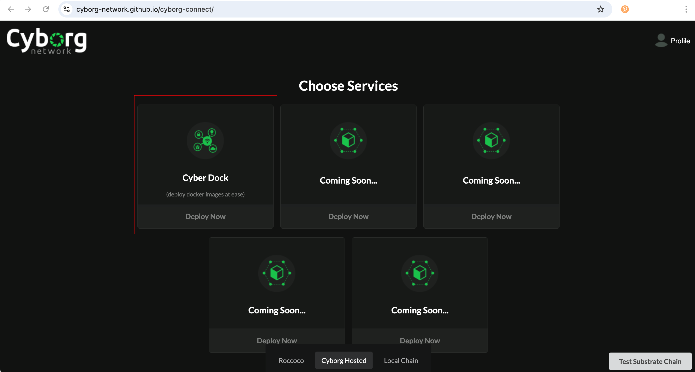
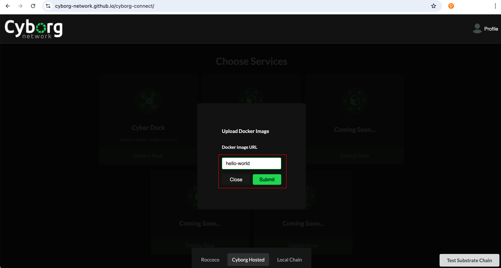
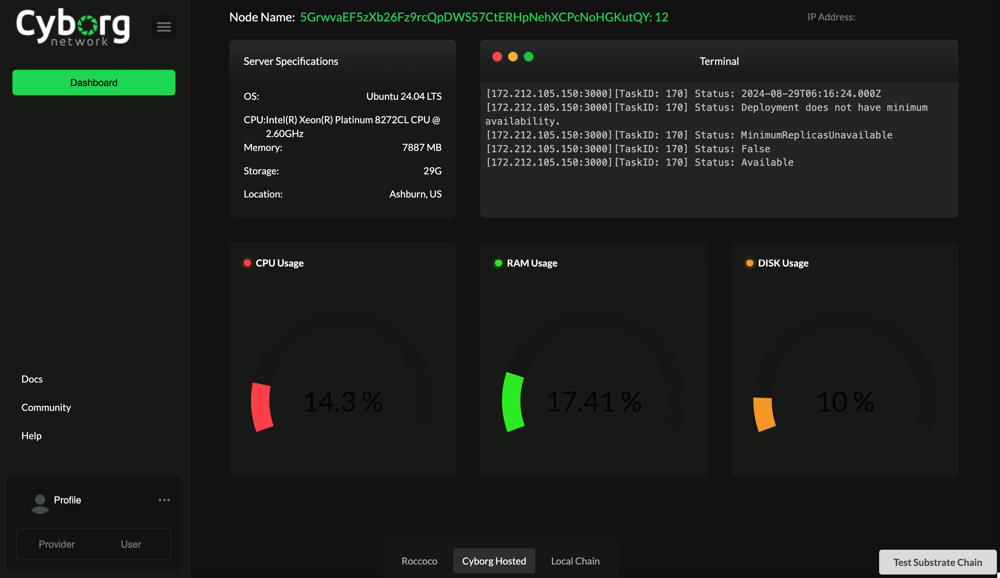

# Cyborg Network - Milestone 1 Delivery

## Introduction:

The baseline infrastructure layer of the Cyborg Network parachain is delivered as part of this grant. This includes a sample product line called CyberDock, which allows users to deploy publicized Docker images into our network of edge servers. The executed container results will be verified by parallel execution and Hash equations.

## Code Repositories:

    [Cyborg Parachain](https://github.com/Cyborg-Network/cyborg-parachain) - (The Cyborg Substrate Parachain)
    [Cyborg Connect](https://github.com/Cyborg-Network/cyborg-connect) - (The Front end for our App)
    [Worker](https://github.com/Cyborg-Network/Worker) - (The K3S worker configuration for execution of docker images)

## Task Examples: 

hello-world - Prints the docker hello world message 
cyborgnetwork/simple-python:new - A sample python program with arithmetic functions
cyborgnetwork/flog_loader:latest - A loader app to test logs

# Testing Guide

## Chain Workflow

The edge-connect pallet provides functionalities to manage connected workers within the system. It provides functionality that registers `register_worker` and removes `remove_worker` workers associated with user accounts. 
There is a storage map that tracks worker details including status, IP, domain, availability status, specs and creation block.

This information is then used by the task-management pallet to issue tasks to connected workers. 

A task can be submitted by any account to a `task_scheduler` extrinsic. The task assigned an account with a registered worker called the `executor`. Once a task is completed, the `executor` submits an extrinsic call `submit_completed_task` with the `TaskId` it was assigned and a hash output of the task. This information is used to then verify the task by another different assigned account with a registered worker called `verifier` which will perform the given task and sumbit its own hash output of the task along with the `TaskId` to an extrinsic call `verify_completed_task`. If the hashes are the same, the task is complete. If they differ, another different account with a registered worker is assigned as the `resolver` role. This account will perform the task and also sumbit a hash output of the task with the same `TaskId` to an extrinsic called `resolve_completed_task`. The matching hash with either of the `executor` or `verifier` is the correct task output. Should the resolver also fail, the task is reassigned to a new executor different from all three participating accounts in this task verification.

## Setup 

Clone the repository with:

```bash
git clone --recurse-submodules https://github.com/Cyborg-Network/cyborg-parachain.git
```

or run:

```bash
git clone https://github.com/Cyborg-Network/cyborg-parachain.git
git submodule update --init
```

Compile the node:

```bash
cargo build --release
```


🐳 Alternatively, build the docker image:

```sh
docker build . -t cyborg-parachain
```

## Run Tests

```bash
cargo test
```
## Local Development Chain

🧟 This project uses [Zombienet](https://github.com/paritytech/zombienet) to orchestrate the relaychain and parachain nodes.
You can grab a [released binary](https://github.com/paritytech/zombienet/releases/latest) or use an [npm version](https://www.npmjs.com/package/@zombienet/cli).

This template produces a parachain node.
You still need a relaychain node - you can download the `polkadot`
(and the accompanying `polkadot-prepare-worker` and `polkadot-execute-worker`)
binaries from [Polkadot SDK releases](https://github.com/paritytech/polkadot-sdk/releases/latest).

Make sure to bring the parachain node - as well as `polkadot`, `polkadot-prepare-worker`, `polkadot-execute-worker`,
and `zombienet` - into `PATH` like so:

```sh
export PATH="./target/release/:$PATH"
```

This way, we can conveniently use them un the following steps.

👥 The following command starts a local development chain, with a single relay chain node and a single parachain collator:

```sh
zombienet --provider native spawn ./zombienet.toml

# Alternatively, the npm version:
npx --yes @zombienet/cli --provider native spawn ./zombienet.toml
```

## Onchain Interaction

### Register a Worker

Go to the [`Polkadotjs Apps`](https://polkadot.js.org/apps/?rpc=ws://127.0.0.1:9988#/) with the correct websocket port set for the parachain (should be port 9988). This should also appear in the terminal for zombienet for `alice-1` in the Direct Link section:


<br></br>

Once your parachain node starts producing blocks, navigate to the extrinsics tab and select the `edge-connect`.


Tick the option to include domain and enter in your domain, or you can tick the option to include an IP/Port.


Then sign and submit the transaction. Congrats, you've registered your worker on chain!

### Task Creation

Anyone can register a task onchain. The task at this point will have to be a valid docker image that is publically accessable. For a task to be created, at least one worker must be registered.

To create a task, navigate to the `taskManagement` extrinsic to select the `taskScheduler` function. Enter in a valid docker image in the `taskData` section then sign and submit.


Go to the explorer section to view which worker called `executor` was assigned the task. This account must complete the task and submit a hash out the task output.


Congrats! A task was successfully scheduled!

### Task Completion and Verification

In order for the task to be successfully verified as complete, two more workers need to be registered. One worker to verify task output correctness and the second in case the first fails the verification. Follow the steps above to register two more workers.

Now, from the same account that was assigned the task, navigate to `taskManagement` extrinsic to the method `submitCompletedTask`. Use the `taskId` and enter in a hash value.


Once submitted, navigate to the explorer section to view which worker was assigned as `verifier`.


Now, from the `verifier` account, navigate to `taskManagement` extrinsic to the method `submitCompletedTask`. Use the `taskId` and enter in a hash value.

You can enter in the same hash value as earlier or a different one. The same hash value will complete the task whereas having a different hash value will assign a `resolver`. 

With the same hash:


Check the explorer to see an event emitted for the taskId that is verified as complete:


Check chain state in `taskManagment` for `taskStatus` call of the `taskId` that it shows `Completed`.


Should the hash from both workers `verifier` and `executor` differ, then a worker will be assigned as `resolver`. You can check for this in the explorer section of the events for `VerifierResolverAssigned` event to find the `resolver`. Following the similar steps as above, you will enter into the `taskManagement` extrinsic and select the `resolveCompletedTask` method to enter in the `taskId` and a output hash.

# Integrated Demo

## Testing with k3s Worker and Frontend

### Setup K3s Workers

K3s Workers are service providers to the network. These workers read from the RPC endpoint of the chain in order to receive updates and info regarding task execution. Each K3s worker has only one `master node` and at least one `worker node`. The `master node` supplies its `IP` or `domain name` to the blockchain so that the chain can distribute tasks to them. 

Once the `master node` receives instructions from the chain, it assigns its `worker nodes` to execute the task. Due to the networking nature of Kubernetes, `master node` and `worker nodes` must be created on different machines ideally within the same local network. 

While setting up servers for the K3s workers, please ensure that you use two unique Ubuntu VMs deployed within the same virtual network to enable seamless connectivity through their local IP addresses. Use a VPC in the case of AWS, and deploy both servers under the same virtual network in the case of Azure.

Below is an example setup of a k3s Worker that connects to our blockchain.
### Master Node Setup

#### 1. Clone and Install Node.js Dependencies

Clone the worker repository

```bash
git clone https://github.com/Cyborg-Network/Worker.git
```

Navigate to your project directory:

```bash
cd Worker
```

Make sure to checkout the branch for the parachain
```bash
git fetch && git branch -a
```
```bash
git checkout -b updated-parachain remotes/origin/updated-parachain
```

Install the required Node.js dependencies:

```bash
npm install
```
#### 2. Environment

Make sure to copy the `.env.example` and replace the contents `WORKER_ADDRESS` to the address you register this worker on the Cyborg Network chain and `RPC_ENDPOINT` to the correct rpc endpoint of the chain you are testing on.

```
cp .env.example .env

```

#### 3. Run Master Setup Script
Execute the MasterSetup.sh script:
```bash
sh MasterSetup.sh
```
This script performs the following actions:

Installs k3s on the master node.
Saves the k3s node join token to `k3s-node-token.txt`
Starts the Node.js application that listens for deployment requests on port 3000.

### Worker Node Setup
After setting up the master node, add worker nodes to the cluster using the join token from `k3s-node-token.txt`. Now on another machine within the same network as the master node, clone the same repository. You do not need to `npm install` or execute the `MasterSetup.sh`. keep track of the `local ip address` of your `master node`. You will need both the `local ip address` and join token in `k3s-node-token.txt` to setup the worker.

#### 1. Execute Worker Setup Script
On each worker node, run the WorkerSetup.sh script with the worker's name (use any name of your choice), master node's private IP address, and the join token present in the `k3s-node-token.txt` file:

```
sh WorkerSetup.sh <worker-name> <master-ip> <token>
```
Replace `<worker-name>`, `<master-ip>`, and `<token>` with your specific details.

Example: 

```
# replace these values with your own ip and token
sh WorkerSetup.sh worker-one 10.0.0.1 K10c8230eebd6c64c5cd5aa1::server:8ce7cae600cd 
```
We have to use the private IP of the master node to connect worker nodes. Private IP can be fetched in the properties tab of the cloud server deployment


#### 2. Check Worker connected
Go back to your master node and execute:

```bash
kubectl get nodes
```
You should see that there is a master node and one worker node. Upon Successful setup proceed to start registering clusters onchain.


<br></br>

Keep in mind that the port 3000 of the master node should accept inbound requests. You will need this for registering the K3s workers on the blockchain along with the IP address.

For more info regarding the worker nodes, you can visit the [`Worker Repository`](https://github.com/Cyborg-Network/Worker/tree/updated-parachain)

#### 3. Register k3s Workers On Chain

##### Prerequisite: Wallets and Account
Only accounts with minimum balance can execute transactions. The Alice account is prefunded with the chain's tokens. If you are testing either locally or using the hosted version of our chain, you will need to use the Alice account. This wallet will be used to interact with the frontend as well.
Using a wallet extension of your choice, switch to the Alice test account or import Alice through the seed phrase:
```
bottom drive obey lake curtain smoke basket hold race lonely fit walk//Alice
```
Here is an example adding the Alice account to polkadotjs wallet 
extension using the seed phrase:
* click the plus icon to reveal a drop down.
* select import account from pre-existing seed
<br></br>


* paste the alice seed phrase and select next
<br></br>

* add a name and password and add the account
<br></br>

* once successful you should see this account
<br></br>


##### Register on k3s

Make sure you have the domain or IP address of your worker node. You will use this to register the worker on chain so that the blockchain can assign tasks to the IP or domain.

* Head over to our [[Hosted Chain]](https://polkadot.js.org/apps/?rpc=wss://fraa-flashbox-3239-rpc.a.stagenet.tanssi.network#/extrinsics)

* Then navigate to the extrinsics tab and select the `edge-connect`.
* Once there, go to domain and tick the option to include it
* enter your domain along with a port 3000 which is used by the K3s Worker node like so `yourIpAddress:3000`. replace `yourIpAddress` your you master node's public Ip address. If you register a domain for your master node, you can use a domain name (e.g. yourWorker-cloud.com).


* Submit and sign the transaction with a funded account


Wait for the transaction to succeed and view it at the block explorer. Congrats, you've registered your worker on chain!


#### Setup Frontend

Note: Also make sure to use a prefunded account to interact with the frontend. Use the above example to import the Alice account to your wallet if you have not already.

##### Step 1
In a seperate terminal or IDE window clone the frontend repository [`Cyborg-Connect`](https://github.com/Cyborg-Network/cyborg-connect/tree/parachain-updates):
```
https://github.com/Cyborg-Network/cyborg-connect.git
```
Make sure to checkout the branch for the parachain
```
git fetch && git branch -a
```
```
git checkout -b parachain-updates remotes/origin/parachain-updates
```
##### Step 2

1) Compile and run Cyborg Connect 
2) Open http://127.0.0.1:8000/cyborg-connect/ in a web browser
3) Switch to Cyborg hosted in the bottom bar
4) In the docker image url section enter any one of the following file names in the [task examples](https://github.com/Cyborg-Network/cyborg-parachain/tree/master?tab=readme-ov-file#task-examples). 
Any app/script/website published as a public docker image for linux/amd64 will execute in this system.
Eg. hello-world (prints hello world message)

#### Test Workflow

1) Connect wallet when prompted, make sure to select the Alice wallet or a funded account and click `Access Compute`
    
2) Select the hosted chain
    
2) Choose CyberDock from the list of product lines
    
3) Enter the docker image name (e.g. hello-world)
    
4) Pay the fees
    
5) Loader Screen
    
6) Node List Screen. There should already be a worker registered on chain already. The tasks are assigned randomly to available worker. If you registered another worker, there is a chance the task may be executed in another worker. Just click through the workers by clicking the left `Dashboard` tab to go back and see the other workers at this time to check the executed task.
    
7) Deployment dashboard 
    
