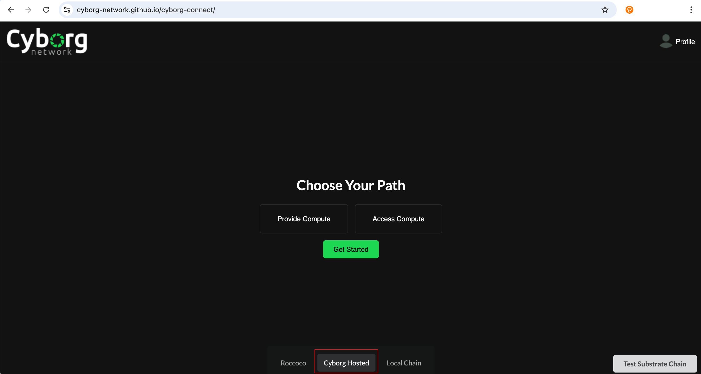

# Cyborg Network - Milestone 1 Delivery

## Introduction:

The baseline infrastructure layer of the Cyborg Network parachain is delivered as part of this grant. This includes a sample product line called CyberDock, which allows users to deploy publicized Docker images into our network of edge servers. The executed container results will be verified by parallel execution and Hash equations.

We have submitted 2 pallets: 

  * Edge Connect - Connection and management of offchain workers (K3S clusters)
  * Task Management - To manage scheduling of tasks into remote K3s clusters based on availability and specifications.

Since this is a prototype for a blockchain-based ML training module with on-chain verification and settlement, the system involves using more than two virtual machines to accurately recreate the real-world scenario of the blockchain and the off-chain components (K3S clusters). These components interact with the blockchain to execute tasks, submit results, and update task execution status in a coordinated manner.

However, to simplify the process of testing the setup of K3S workers and their connection to the Substrate blockchain, we have a pre-hosted version of the Cyborg parachain on the Tanssi Dancebox testnet. This setup includes an active K3S cluster, allowing you to directly test the application's workflow. We will discuss both methods of testing to provide better clarity regarding the delivery

## Code Repositories:

* [Cyborg Parachain](https://github.com/Cyborg-Network/cyborg-parachain) - ([The Cyborg Substrate Parachain](https://github.com/Cyborg-Network/cyborg-parachain/blob/master/INSTRUCTIONS.md#prerequisite-wallets-and-account))
* [Cyborg Connect](https://github.com/Cyborg-Network/cyborg-connect) - (The Front end for our App)
* [Worker](https://github.com/Cyborg-Network/Worker) - (The K3S worker configuration for execution of docker images)

## Chain Workflow

The edge-connect pallet provides functionalities to manage connected workers within the system. It provides functionality that registers `register_worker` and removes `remove_worker` workers associated with user accounts. 
There is a storage map that tracks worker details including status, IP, domain, availability status, specs and creation block.

This information is then used by the task-management pallet to issue tasks to connected workers. 

A task can be submitted by any account to a `task_scheduler` extrinsic. The task assigned to an account with a registered worker called the `executor`. Once a task is completed, the `executor` submits an extrinsic call `submit_completed_task` with the `TaskId` it was assigned and a hash output of the task. This information is used to then verify the task by another different assigned account with a registered worker called `verifier` which will perform the given task and sumbit its own hash output of the task along with the `TaskId` to an extrinsic call `verify_completed_task`. If the hashes are the same, the task is complete. If they differ, another different account with a registered worker is assigned as the `resolver` role. This account will perform the task and also sumbit a hash output of the task with the same `TaskId` to an extrinsic called `resolve_completed_task`. The matching hash with either of the `executor` or `verifier` is the correct task output. Should the resolver also fail, the task is reassigned to a new executor different from all three participating accounts in this task verification.

## Task Examples: 

* hello-world - Prints the docker hello world message 
* cyborgnetwork/simple-python:new - A sample python program with arithmetic functions
* cyborgnetwork/flog_loader:latest - A loader app to test logs
  
# Testing Guide

## 1. Testing the hosted version

1) Compile and run [Cyborg Connect](https://github.com/Cyborg-Network/cyborg-connect) 
2) Open http://127.0.0.1:8000/cyborg-connect/ in a web browser
3) Switch to Cyborg hosted in the bottom bar
4) Shift your polkadotjs wallet address to match the Alice keypair, which is a prefunded account (The instrcutions can be found here)
5) In the docker image url section enter any one of the following file names in the [task examples](https://github.com/Cyborg-Network/cyborg-parachain/tree/master?tab=readme-ov-file#task-examples). 
Any app/script/website published as a public docker image for linux/amd64 will execute in this system.
Eg. hello-world (prints hello world message)

#### Test Workflow

1) Connect wallet when prompted, make sure to select the Alice wallet or a funded account and click `Access Compute`
    
2) Select the hosted chain
    
2) Choose CyberDock from the list of product lines
    
3) Enter the docker image name (e.g. hello-world)
    
4) Pay the fees
    
5) Loader Screen
    
6) Node List Screen. There should already be a worker registered on chain already. The tasks are assigned randomly to available worker. If you registered another worker, there is a chance the task may be executed in another worker. Just click through the workers by clicking the left `Dashboard` tab to go back and see the other workers at this time to check the executed task.
    
7) Deployment dashboard 
    
   
## 2. Local Testing

## Infrastructure setup


## Setup 

Clone the parachain repository with:

```bash
git clone --recurse-submodules https://github.com/Cyborg-Network/cyborg-parachain.git
```

or run:

```bash
git clone https://github.com/Cyborg-Network/cyborg-parachain.git
git submodule update --init
```

Compile the node:

```bash
cargo build --release
```

🐳 Alternatively, build the docker image:

```sh
docker build . -t cyborg-parachain
```

## Run Tests

```bash
cargo test
```
## Local Development Chain

🧟 This project uses [Zombienet](https://github.com/paritytech/zombienet) to orchestrate the relaychain and parachain nodes.
You can grab a [released binary](https://github.com/paritytech/zombienet/releases/latest) or use an [npm version](https://www.npmjs.com/package/@zombienet/cli).

This template produces a parachain node.
You still need a relaychain node - you can download the `polkadot`
(and the accompanying `polkadot-prepare-worker` and `polkadot-execute-worker`)
binaries from [Polkadot SDK releases](https://github.com/paritytech/polkadot-sdk/releases/latest).

Make sure to bring the parachain node - as well as `polkadot`, `polkadot-prepare-worker`, `polkadot-execute-worker`,
and `zombienet` - into `PATH` like so:

```sh
export PATH="./target/release/:$PATH"
```

This way, we can conveniently use them un the following steps.

👥 The following command starts a local development chain, with a single relay chain node and a single parachain collator:

```sh
zombienet --provider native spawn ./zombienet.toml

# Alternatively, the npm version:
npx --yes @zombienet/cli --provider native spawn ./zombienet.toml
```

## Onchain Interaction

### Register a Worker

Go to the [`Polkadotjs Apps`](https://polkadot.js.org/apps/?rpc=ws://127.0.0.1:9988#/) with the correct websocket port set for the parachain (should be port 9988). This should also appear in the terminal for zombienet for `alice-1` in the Direct Link section:


<br></br>

Once your parachain node starts producing blocks, navigate to the extrinsics tab and select the `edge-connect`.


Tick the option to include domain and enter in your domain, or you can tick the option to include an IP/Port.


Then sign and submit the transaction. Congrats, you've registered your worker on chain!

### Task Creation

Anyone can register a task onchain. The task at this point will have to be a valid docker image that is publically accessable. For a task to be created, at least one worker must be registered.

To create a task, navigate to the `taskManagement` extrinsic to select the `taskScheduler` function. Enter in a valid docker image in the `taskData` section then sign and submit.


Go to the explorer section to view which worker called `executor` was assigned the task. This account must complete the task and submit a hash out the task output.


Congrats! A task was successfully scheduled!

### Task Completion and Verification

In order for the task to be successfully verified as complete, two more workers need to be registered. One worker to verify task output correctness and the second in case the first fails the verification. Follow the steps above to register two more workers.

Now, from the same account that was assigned the task, navigate to `taskManagement` extrinsic to the method `submitCompletedTask`. Use the `taskId` and enter in a hash value.


Once submitted, navigate to the explorer section to view which worker was assigned as `verifier`.


Now, from the `verifier` account, navigate to `taskManagement` extrinsic to the method `submitCompletedTask`. Use the `taskId` and enter in a hash value.

You can enter in the same hash value as earlier or a different one. The same hash value will complete the task whereas having a different hash value will assign a `resolver`. 

With the same hash:


Check the explorer to see an event emitted for the taskId that is verified as complete:


Check chain state in `taskManagment` for `taskStatus` call of the `taskId` that it shows `Completed`.


Should the hash from both workers `verifier` and `executor` differ, then a worker will be assigned as `resolver`. You can check for this in the explorer section of the events for `VerifierResolverAssigned` event to find the `resolver`. Following the similar steps as above, you will enter into the `taskManagement` extrinsic and select the `resolveCompletedTask` method to enter in the `taskId` and a output hash.


## Testing with k3s Worker and Frontend

### Setup K3s Workers

K3s Workers are service providers to the network. These workers read from the RPC endpoint of the chain in order to receive updates and info regarding task execution. Each K3s worker has only one `master node` and at least one `worker node`. The `master node` supplies its `IP` or `domain name` to the blockchain so that the chain can distribute tasks to them. 

Once the `master node` receives instructions from the chain, it assigns its `worker nodes` to execute the task. Due to the networking nature of Kubernetes, `master node` and `worker nodes` must be created on different machines ideally within the same local network. 

While setting up servers for the K3s workers, please ensure that you use two unique Ubuntu VMs deployed within the same virtual network to enable seamless connectivity through their local IP addresses. Use a VPC in the case of AWS, and deploy both servers under the same virtual network in the case of Azure.

Below is an example setup of a k3s Worker that connects to our blockchain.
### Master Node Setup

#### 1. Clone and Install Node.js Dependencies

Clone the worker repository

```bash
git clone https://github.com/Cyborg-Network/Worker.git
```

Navigate to your project directory:

```bash
cd Worker
```

Make sure to checkout the branch for the parachain
```bash
git fetch && git branch -a
```
```bash
git checkout -b updated-parachain remotes/origin/updated-parachain
```

Install the required Node.js dependencies:

```bash
npm install
```
#### 2. Environment

Make sure to copy the `.env.example` and replace the contents `WORKER_ADDRESS` to the address you register this worker on the Cyborg Network chain and `RPC_ENDPOINT` to the correct rpc endpoint of the chain you are testing on.

```
cp .env.example .env

```

#### 3. Run Master Setup Script
Execute the MasterSetup.sh script:
```bash
sh MasterSetup.sh
```
This script performs the following actions:

Installs k3s on the master node.
Saves the k3s node join token to `k3s-node-token.txt`
Starts the Node.js application that listens for deployment requests on port 3000.

### Worker Node Setup
After setting up the master node, add worker nodes to the cluster using the join token from `k3s-node-token.txt`. Now on another machine within the same network as the master node, clone the same repository. You do not need to `npm install` or execute the `MasterSetup.sh`. keep track of the `local ip address` of your `master node`. You will need both the `local ip address` and join token in `k3s-node-token.txt` to setup the worker.

#### 1. Execute Worker Setup Script
On each worker node, run the WorkerSetup.sh script with the worker's name (use any name of your choice), master node's private IP address, and the join token present in the `k3s-node-token.txt` file:

```
sh WorkerSetup.sh <worker-name> <master-ip> <token>
```
Replace `<worker-name>`, `<master-ip>`, and `<token>` with your specific details.

Example: 

```
# replace these values with your own ip and token
sh WorkerSetup.sh worker-one 10.0.0.1 K10c8230eebd6c64c5cd5aa1::server:8ce7cae600cd 
```
We have to use the private IP of the master node to connect worker nodes. Private IP can be fetched in the properties tab of the cloud server deployment


#### 2. Check Worker connected
Go back to your master node and execute:

```bash
kubectl get nodes
```
You should see that there is a master node and one worker node. Upon Successful setup proceed to start registering clusters onchain.


<br></br>

Keep in mind that the port 3000 of the master node should accept inbound requests. You will need this for registering the K3s workers on the blockchain along with the IP address.

For more info regarding the worker nodes, you can visit the [`Worker Repository`](https://github.com/Cyborg-Network/Worker/tree/updated-parachain)

#### 3. Register k3s Workers On Chain

##### Prerequisite: Wallets and Account
Only accounts with minimum balance can execute transactions. The Alice account is prefunded with the chain's tokens. If you are testing either locally or using the hosted version of our chain, you will need to use the Alice account. This wallet will be used to interact with the frontend as well.
Using a wallet extension of your choice, switch to the Alice test account or import Alice through the seed phrase:
```
bottom drive obey lake curtain smoke basket hold race lonely fit walk//Alice
```
Here is an example adding the Alice account to polkadotjs wallet 
extension using the seed phrase:
* click the plus icon to reveal a drop down.
* select import account from pre-existing seed
<br></br>


* paste the alice seed phrase and select next
<br></br>

* add a name and password and add the account
<br></br>

* once successful you should see this account
<br></br>


##### Register on k3s

Make sure you have the domain or IP address of your worker node. You will use this to register the worker on chain so that the blockchain can assign tasks to the IP or domain.

* Head over to our [[Hosted Chain]](https://polkadot.js.org/apps/?rpc=wss://fraa-flashbox-3239-rpc.a.stagenet.tanssi.network#/extrinsics)

* Then navigate to the extrinsics tab and select the `edge-connect`.
* Once there, go to domain and tick the option to include it
* enter your domain along with a port 3000 which is used by the K3s Worker node like so `yourIpAddress:3000`. replace `yourIpAddress` your you master node's public Ip address. If you register a domain for your master node, you can use a domain name (e.g. yourWorker-cloud.com).


* Submit and sign the transaction with a funded account


Wait for the transaction to succeed and view it at the block explorer. Congrats, you've registered your worker on chain!


#### Setup Frontend

Note: Also make sure to use a prefunded account to interact with the frontend. Use the above example to import the Alice account to your wallet if you have not already.

##### Step 1
In a seperate terminal or IDE window clone the frontend repository [`Cyborg-Connect`](https://github.com/Cyborg-Network/cyborg-connect/tree/parachain-updates):
```
https://github.com/Cyborg-Network/cyborg-connect.git
```
Make sure to checkout the branch for the parachain
```
git fetch && git branch -a
```
```
git checkout -b parachain-updates remotes/origin/parachain-updates
```
##### Step 2


# Worker Logs:

The results of executed tasks can be viewed with the logs appearing on the terminal section of the deployment dashboard. Here are some of the worker log examples for the above mentioned task examples. 

## Hello World:

    [172.212.108.104:3000][TaskID: 74] Status: 2024-08-06T13:54:01.000Z
    [172.212.108.104:3000][TaskID: 74] Status: ReplicaSet "dynamic-deployment-569b8o-54cc46b66d" has successfully progressed.
    [172.212.108.104:3000][TaskID: 74] Status: NewReplicaSetAvailable
    [172.212.108.104:3000][TaskID: 74] Status: True
    [172.212.108.104:3000][TaskID: 74] Status: Progressing
    [172.212.108.104:3000][TaskID: 74] Logs: Hello from Docker! This message shows that your installation appears to be working correctly. To generate this message, Docker took the following steps: 1. The Docker client contacted the Docker daemon. 2. The Docker daemon pulled the "hello-world" image from the Docker Hub. (amd64) 3. The Docker daemon created a new container from that image which runs the executable that produces the output you are currently reading. 4. The Docker daemon streamed that output to the Docker client, which sent it to your terminal. To try something more ambitious, you can run an Ubuntu container with: $ docker run -it ubuntu bash Share images, automate workflows, and more with a free Docker ID: https://hub.docker.com/ For more examples and ideas, visit: https://docs.docker.com/get-started/


## Simple python:

    [172.212.108.104:3000][TaskID: 75] Status: 2024-08-06T13:58:07.000Z
    [172.212.108.104:3000][TaskID: 75] Status: ReplicaSet "dynamic-deployment-mkiqwb-764c6c87" has successfully progressed.
    [172.212.108.104:3000][TaskID: 75] Status: NewReplicaSetAvailable
    [172.212.108.104:3000][TaskID: 75] Status: True
    [172.212.108.104:3000][TaskID: 75] Status: Progressing
    [172.212.108.104:3000][TaskID: 75] Logs: Let's look at some basic math operations one by one 10 + 5 = 15 10 - 5 = 5 10 x 5 = 50 10/5 = 2.0 10^5 = 100 Factorial of 5: 120 Logarithm (base e): 1.0 Sine (of 30 degrees): 0.49999999999999994 Cosine (of 45 degrees): 0.7071067811865476 Tangent (of 60 degrees): 1.7320508075688767 Test Complete!!


## Flog Loader:

    [172.212.108.104:3000][TaskID: 76] Status: 2024-08-06T13:59:25.000Z
    [172.212.108.104:3000][TaskID: 76] Status: ReplicaSet "dynamic-deployment-326ael-59f7557547" has successfully progressed.
    [172.212.108.104:3000][TaskID: 76] Status: NewReplicaSetAvailable
    [172.212.108.104:3000][TaskID: 76] Status: True
    [172.212.108.104:3000][TaskID: 76] Status: Progressing
    [172.212.108.104:3000][TaskID: 76] Logs: 133.122.255.57 - wintheiser6332 [06/Aug/2024:13:59:27 +0000] "PUT /next-generation/scale HTTP/1.0" 200 2094 169.217.248.61 - krajcik8327 [06/Aug/2024:13:59:27 +0000] "HEAD /e-enable/repurpose/best-of-breed/web+services HTTP/1.1" 302 1496 219.150.119.243 - - [06/Aug/2024:13:59:27 +0000] "HEAD /paradigms/users/networks/visionary HTTP/1.1" 203 1720 205.181.52.92 - mohr3286 [06/Aug/2024:13:59:27 +0000] "DELETE /revolutionize/repurpose/interfaces HTTP/2.0" 502 25014 221.191.100.146 - - [06/Aug/2024:13:59:27 +0000] "PUT /unleash/transition/innovate/cutting-edge HTTP/1.0" 504 18160 198.99.83.98 - - [06/Aug/2024:13:59:27 +0000] "DELETE /models/sticky/drive/repurpose HTTP/1.0" 503 15005 128.128.104.12 - - [06/Aug/2024:13:59:27 +0000] "PATCH /interactive/synergize/holistic/seize HTTP/1.0" 400 26731 217.66.202.111 - herman1613 [06/Aug/2024:13:59:27 +0000] "POST /ubiquitous/innovate/utilize HTTP/1.0" 302 1253 66.55.244.23 - - [06/Aug/2024:13:59:27 +0000] "GET /evolve HTTP/1.1" 203 982 33.43.231.205 - kuvalis2662 [06/Aug/2024:13:59:27 +0000] "HEAD /engage HTTP/1.1" 204 13898 229.76.176.117 - - [06/Aug/2024:13:59:27 +0000] "DELETE /monetize/orchestrate HTTP/2.0" 302 15400 205.99.160.214 - - [06/Aug/2024:13:59:27 +0000] "POST /synthesize/unleash HTTP/1.1" 301 4818 142.231.87.13 - hettinger8564 [06/Aug/2024:13:59:27 +0000] "DELETE /expedite/e-enable/redefine HTTP/1.1" 204 26815 178.57.223.231 - - [06/Aug/2024:13:59:27 +0000] "POST /content/value-added/bleeding-edge HTTP/1.0" 200 5631 206.138.70.85 - renner6635 [06/Aug/2024:13:59:27 +0000] "PATCH /evolve/iterate/exploit HTTP/1.0" 400 22447 173.97.14.35 - - [06/Aug/2024:13:59:27 +0000] "DELETE /deploy/reinvent HTTP/1.0" 403 255 20.153.146.178 - - [06/Aug/2024:13:59:27 +0000] "DELETE /productize HTTP/1.1" 401 20413 182.140.64.142 - - [06/Aug/2024:13:59:27 +0000] "GET /frictionless/technologies HTTP/1.1" 404 26944 233.158.237.53 - - [06/Aug/2024:13:59:27 +0000] "PATCH /world-class/portals HTTP/1.1" 500 26419 223.117.253.103 - - [06/Aug/2024:13:59:27 +0000] "POST /facilitate HTTP/1.0" 501 3545 6.200.160.191 - schaden2671 [06/Aug/2024:13:59:27 +0000] "GET /vertical/best-of-breed/incentivize HTTP/2.0" 200 9874 113.6.51.228 - - [06/Aug/2024:13:59:27 +0000] "DELETE /syndicate/bleeding-edge/front-end/scale HTTP/1.1" 205 16420 213.247.72.172 - witting8588 [06/Aug/2024:13:59:27 +0000] "PATCH /interactive/seamless/e-business HTTP/1.1" 504 9608 96.250.108.182 - king1218 [06/Aug/2024:13:59:27 +0000] "POST /transition/ubiquitous HTTP/2.0" 403 12068 50.210.127.195 - quigley2241 [06/Aug/2024:13:59:27 +0000] "HEAD /methodologies/deploy HTTP/2.0" 301 27407 6.107.12.88 - - [06/Aug/2024:13:59:27 +0000] "POST /engineer HTTP/1.0" 403 23135 253.76.223.107 - - [06/Aug/2024:13:59:27 +0000] "DELETE /virtual HTTP/1.0" 416 17932 168.150.179.6 - schroeder1815 [06/Aug/2024:13:59:27 +0000] "DELETE /orchestrate/e-business HTTP/1.0" 205 1139 125.189.80.43 - koss1671 [06/Aug/2024:13:59:27 +0000] "POST /frictionless/frictionless HTTP/1.0" 401 18946 112.49.83.207 - ortiz1148 [06/Aug/2024:13:59:27 +0000] "GET /incentivize HTTP/1.0" 200 25120 254.84.164.62 - larson8158 [06/Aug/2024:13:59:27 +0000] "PUT /revolutionary HTTP/2.0" 204 21246 252.79.190.163 - - [06/Aug/2024:13:59:27 +0000] "GET /partnerships/visualize/distributed/utilize HTTP/2.0" 302 26962 14.38.9.69 - gleason5311 [06/Aug/2024:13:59:27 +0000] "DELETE /enable/schemas/orchestrate/incentivize HTTP/1.0" 404 5878 141.210.172.240 - gerhold2783 [06/Aug/2024:13:59:27 +0000] "GET /enterprise/eyeballs HTTP/1.0" 204 13200 143.203.250.79 - bradtke7066 [06/Aug/2024:13:59:27 +0000] "HEAD /architectures/open-source/cutting-edge/enhance HTTP/1.0" 501 9126 81.49.225.99 - pouros3676 [06/Aug/2024:13:59:27 +0000] "POST /grow/synergies HTTP/1.1" 404 9411 241.20.91.187 - - [06/Aug/2024:13:59:27 +0000] "GET /monetize HTTP/1.1" 503 13615 224.106.184.3 - lind2740 [06/Aug/2024:13:59:27 +0000] "PATCH /global/extend HTTP/1.1" 100 24105 154.255.244.193 - - [06/Aug/2024:13:59:27 +0000] "DELETE /systems/interactive HTTP/2.0" 201 17032 87.244.113.77 - cormier6054 [06/Aug/2024:13:59:27 +0000] "HEAD /frictionless/extend/morph HTTP/2.0" 304 25862 46.209.29.76 - hilpert1457 [06/Aug/2024:13:59:27 +0000] "PUT /user-centric/proactive/visionary HTTP/1.1" 204 17537 130.207.222.49 - - [06/Aug/2024:13:59:27 +0000] "PUT /24%2f7/visualize HTTP/2.0" 406 15760 2.210.154.157 - lueilwitz3714 [06/Aug/2024:13:59:27 +0000] "PUT /scale/customized/b2b/cultivate HTTP/1.1" 301 2709 101.195.167.124 - - [06/Aug/2024:13:59:27 +0000] "HEAD /transition/rich/exploit/synergize HTTP/1.1" 205 17096 228.28.71.149 - - [06/Aug/2024:13:59:27 +0000] "HEAD /streamline/scalable/envisioneer/mission-critical HTTP/1.0" 401 5440 194.71.147.240 - - [06/Aug/2024:13:59:27 +0000] "DELETE /interactive/collaborative HTTP/1.1" 203 18018 167.74.143.194 - - [06/Aug/2024:13:59:27 +0000] "GET /next-generation/schemas/solutions/extensible HTTP/2.0" 203 5408 33.79.209.76 - - [06/Aug/2024:13:59:27 +0000] "PATCH /action-items/enable/seamless/mission-critical HTTP/1.0" 502 25038 179.212.18.22 - - [06/Aug/2024:13:59:27 +0000] "PUT /disintermediate/distributed/deliverables/synergistic HTTP/1.1" 500 424 205.60.37.110 - dibbert1188 [06/Aug/2024:13:59:27 +0000] "GET /user-centric/expedite HTTP/1.1" 301 15257 140.188.240.66 - kautzer5027 [06/Aug/2024:13:59:27 +0000] "HEAD /e-commerce/robust HTTP/1.0" 204 26942 26.203.4.91 - - [06/Aug/2024:13:59:27 +0000] "GET /infrastructures HTTP/1.1" 401 14794 184.23.199.30 - - [06/Aug/2024:13:59:27 +0000] "PUT /leading-edge/cultivate/ubiquitous HTTP/1.1" 400 7430 99.172.241.163 - kris7025 [06/Aug/2024:13:59:27 +0000] "POST /vortals HTTP/1.1" 304 23543 41.243.110.180 - - [06/Aug/2024:13:59:27 +0000] "PUT /viral/viral/innovate/b2c HTTP/1.1" 201 26068 229.162.235.184 - - [06/Aug/2024:13:59:27 +0000] "PATCH /integrated/turn-key/cutting-edge/streamline HTTP/1.1" 404 29084 165.188.184.158 - stiedemann2570 [06/Aug/2024:13:59:27 +0000] "GET /bleeding-edge/mission-critical HTTP/1.0" 405 5194 162.225.99.163 - flatley2402 [06/Aug/2024:13:59:27 +0000] "POST /world-class HTTP/1.1" 500 24392 129.170.147.55 - shanahan5205 [06/Aug/2024:13:59:27 +0000] "PATCH /synthesize HTTP/1.0" 500 993 96.109.167.97 - weber5656 [06/Aug/2024:13:59:27 +0000] "POST /experiences/one-to-one/open-source/enable HTTP/1.0" 501 12270 157.75.161.117 - swaniawski3551 [06/Aug/2024:13:59:27 +0000] "PATCH /deploy/convergence/facilitate HTTP/2.0" 503 27450 239.24.222.56 - king4331 [06/Aug/2024:13:59:27 +0000] "PATCH /brand HTTP/2.0" 401 16091 230.207.252.224 - - [06/Aug/2024:13:59:27 +0000] "HEAD /dot-com HTTP/1.1" 201 13833 192.131.65.115 - - [06/Aug/2024:13:59:27 +0000] "PUT /innovative/real-time/envisioneer HTTP/1.1" 501 1991 204.157.213.98 - - [06/Aug/2024:13:59:27 +0000] "GET /reintermediate/empower HTTP/1.1" 500 9699 97.173.9.9 - - [06/Aug/2024:13:59:27 +0000] "GET /visionary/cutting-edge/vertical/integrate HTTP/1.0" 405 1188 51.200.5.26 - - [06/Aug/2024:13:59:27 +0000] "PATCH /real-time/open-source/exploit HTTP/1.0" 200 2050 109.126.6.191 - dietrich6340 [06/Aug/2024:13:59:27 +0000] "PUT /incentivize/best-of-breed/e-business HTTP/2.0" 205 14769 218.200.54.209 - labadie8826 [06/Aug/2024:13:59:27 +0000] "HEAD /architect/world-class/disintermediate/target HTTP/1.1" 503 14097 148.130.36.237 - torp2162 [06/Aug/2024:13:59:27 +0000] "PUT /redefine/monetize HTTP/2.0" 200 6111 84.57.22.131 - treutel8628 [06/Aug/2024:13:59:27 +0000] "POST /e-markets/out-of-the-box HTTP/2.0" 406 22638 29.131.91.145 - - [06/Aug/2024:13:59:27 +0000] "GET /vortals/grow/e-markets/cutting-edge HTTP/1.1" 400 18104 88.70.175.76 - - [06/Aug/2024:13:59:27 +0000] "HEAD /wireless/e-services HTTP/1.1" 503 22700 219.49.140.147 - - [06/Aug/2024:13:59:27 +0000] "PUT /enterprise/compelling/drive/dot-com HTTP/1.0" 204 2283 41.137.212.37 - daniel4557 [06/Aug/2024:13:59:27 +0000] "GET /bleeding-edge/cross-media/real-time/user-centric HTTP/1.1" 201 28351 69.69.232.32 - - [06/Aug/2024:13:59:27 +0000] "PATCH /b2c/content HTTP/1.1" 400 22206 141.58.104.76 - langworth3388 [06/Aug/2024:13:59:27 +0000] "PUT /evolve/technologies HTTP/2.0" 501 26446 28.192.90.164 - - [06/Aug/2024:13:59:27 +0000] "DELETE /24%2f365/exploit HTTP/1.1" 501 17726 221.228.76.123 - ritchie7421 [06/Aug/2024:13:59:27 +0000] "GET /next-generation/enable HTTP/2.0" 403 8782 18.224.134.26 - - [06/Aug/2024:13:59:27 +0000] "POST /synergies/implement/synergistic HTTP/1.0" 302 21571 121.96.21.68 - sipes6211 [06/Aug/2024:13:59:27 +0000] "GET /interfaces/collaborative/platforms/empower HTTP/1.1" 504 18354 105.212.138.108 - - [06/Aug/2024:13:59:27 +0000] "PATCH /visionary HTTP/2.0" 406 16391 186.33.19.210 - - [06/Aug/2024:13:59:27 +0000] "GET /embrace/out-of-the-box/user-centric/web-enabled HTTP/2.0" 205 8941 199.115.194.221 - johnston7278 [06/Aug/2024:13:59:27 +0000] "HEAD /action-items/aggregate HTTP/2.0" 301 28312 38.137.189.82 - - [06/Aug/2024:13:59:27 +0000] "PATCH /supply-chains HTTP/2.0" 304 1192 81.115.147.179 - abbott2381 [06/Aug/2024:13:59:27 +0000] "HEAD /facilitate/extend/orchestrate HTTP/2.0" 500 18241 18.194.16.7 - bogan5472 [06/Aug/2024:13:59:27 +0000] "HEAD /front-end/expedite/visionary HTTP/2.0" 204 27817 183.204.166.90 - gleichner4885 [06/Aug/2024:13:59:27 +0000] "PUT /plug-and-play HTTP/1.0" 304 10059 183.204.44.219 - bogisich8618 [06/Aug/2024:13:59:27 +0000] "GET /magnetic/intuitive HTTP/1.1" 400 9003 75.229.249.168 - - [06/Aug/2024:13:59:27 +0000] "PUT /bricks-and-clicks/visualize/open-source HTTP/1.0" 403 12414 239.4.4.190 - robel1013 [06/Aug/2024:13:59:27 +0000] "GET /plug-and-play/utilize/robust HTTP/2.0" 406 617 198.184.32.195 - fisher2418 [06/Aug/2024:13:59:27 +0000] "POST /envisioneer/deploy/synergize HTTP/2.0" 100 16384 207.161.197.223 - mckenzie1642 [06/Aug/2024:13:59:27 +0000] "PUT /next-generation HTTP/1.0" 400 19030 105.253.177.66 - rohan4730 [06/Aug/2024:13:59:27 +0000] "GET /enterprise HTTP/1.1" 405 12187 104.218.157.142 - - [06/Aug/2024:13:59:27 +0000] "POST /infrastructures/transparent/interactive/bandwidth HTTP/1.0" 501 15912 205.170.254.118 - rempel5050 [06/Aug/2024:13:59:27 +0000] "POST /implement/e-business HTTP/1.1" 400 29954 18.100.44.86 - bergstrom4505 [06/Aug/2024:13:59:27 +0000] "DELETE /open-source/transition HTTP/2.0" 201 8571 67.133.58.195 - bernier4787 [06/Aug/2024:13:59:27 +0000] "PUT /granular/relationships HTTP/1.1" 403 2473 10.117.48.233 - - [06/Aug/2024:13:59:27 +0000] "GET /wireless HTTP/1.0" 501 6537 247.162.177.124 - herman7272 [06/Aug/2024:13:59:27 +0000] "PUT /architect/relationships HTTP/2.0" 205 20722


